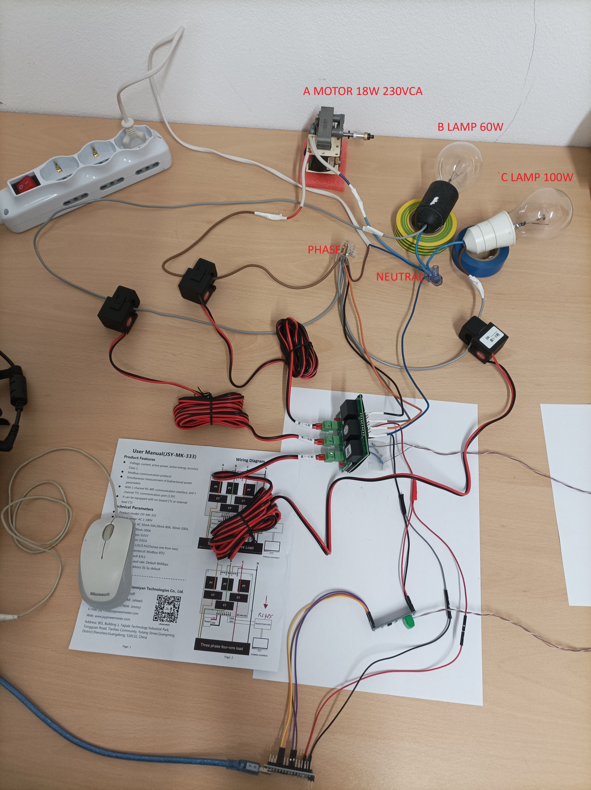

# ApJSY333
Library for interfacing meter JSY-MK-333 with Arduino

Specific to model JSY-MK-333, it uses a direct approach to the meter without the need to know the Modbus protocol.
This three-phase meter (3 phases 4 wires) can also be used in single-phase, as 3 singe-phase meter on 3 different
load. (with 1 single-phase power source. 



## Getting Started

very simple !

```c++

// Sample program for usage ApJSY333 library whith Arduino Nano
// For instructions, go to https://github.com/AntonioPrevitali/ApJSY333
// Created by Antonio Previtali 29/07/2025

// This is identical to Sample1, but I only display the fields that are relevant for single fase use
// with 3 loads.

// Meter configuration is default ( address 1 9600bps 8,N,1 )

// Aduino Nano -->  5 Volt TTL to RS485 converter (max485 DE RE pin) ---> JSY-MK-333 three-phase meter

// The JSY-MK-333 also has a serial output (3.3V, not directly connectable to the 5V Arduinos), so I preferred
// to communicate via the RS485 bus.
// Obviously, however, you also need the 5V to RS485 TTL converter for Arduino.
 
//   use arduino Serial as console.
//   use AltSoftSerial which goes on pins 8 and 9, on 8 Arduino receives data and on 9 Arduino transmits data.

//   Pin for the 5v TTL to RS485 converter:
//     DI connected to PIN 9 arduino which is where arduino transmits data with AltSoftSerial.
//     DE is the MAX485 PIN to enable the transmission of data it receives on the DI. HIGH to enable. I USED PIN 4
//     RO connected to Arduino PIN 8 which is where Arduino receives data with AltSoftSerial.
//     RE is the PIN of the MAX485 to enable reception which sends out on its RO pin LOW to enable I USED PIN 5
//

#include <Arduino.h>

#include <AltSoftSerial.h>   // library for an extra serial port for arduino nano.
                             // seee AltSoftSerial docu.

#include <ApJSY333.h>      // library for meter JSY-MK-333

ApJSY333 MyJSY333;     // declare object MyJSY333

AltSoftSerial altSerial; // object for AltSoftSerial (pin 8 and 9 seee AltSoftSerial docu)


void setup() {

    Serial.begin(9600);    // serial monitor console at 9600 bps
    while(!Serial){};
    delay(200); 

    pinMode(4, OUTPUT);         // DE max 485
    pinMode(5, OUTPUT);         // RE max 485
    altSerial.begin(9600);                        // default speed of meter.
    MyJSY333.UseSerialAndEPin(&altSerial,4,5);    // pass stream and pin to use at library.
                                                  // Please note that PinMode is not executed by the library, so you must execute PinMode, see the code.

    delay(200);   // a bit of time to start altSerial (NOT REMOVE, TEST)
    
}


void loop() {
 
    // 1 is the meter address. By default, the meter is set to address 1.
    // Use the JSY software to set the meter to a different address.
    // This is necessary if you want to use more than one meter. 
    // Simple is usage default address 1.
 
    // I only display the fields that are relevant for single fase use
    // with 3 loads.
    
    if ( MyJSY333.okReadMeter(1) )   
    {
      Serial.println(F("----------------------- JSY-MK-333 -------------------------------------"));
      Serial.print(F("VoltageA = "));
      Serial.println(MyJSY333.VoltageA);
      Serial.print(F("VoltageB = "));
      Serial.println(MyJSY333.VoltageB);
      Serial.print(F("VoltageC = "));
      Serial.println(MyJSY333.VoltageC);
      Serial.print(F("CurrentA = "));
      Serial.println(MyJSY333.CurrentA);
      Serial.print(F("CurrentB = "));
      Serial.println(MyJSY333.CurrentB);
      Serial.print(F("CurrentC = "));
      Serial.println(MyJSY333.CurrentC);
      Serial.print(F("ActivePowerA = "));
      Serial.println(MyJSY333.ActivePowerA);
      Serial.print(F("ActivePowerB = "));
      Serial.println(MyJSY333.ActivePowerB);
      Serial.print(F("ActivePowerC = "));
      Serial.println(MyJSY333.ActivePowerC);      
      Serial.print(F("TotalActivePower (W) = "));
      Serial.println(MyJSY333.TotalActivePower); 
      Serial.print(F("ReactivePowerA (var) = "));
      Serial.println(MyJSY333.ReactivePowerA);
      Serial.print(F("ReactivePowerB (var) = "));
      Serial.println(MyJSY333.ReactivePowerB);
      Serial.print(F("ReactivePowerC (var) = "));
      Serial.println(MyJSY333.ReactivePowerC);
      Serial.print(F("TotalReactivePower (var) = "));
      Serial.println(MyJSY333.TotalReactivePower);
      Serial.print(F("ApparentPowerA (VA) = "));
      Serial.println(MyJSY333.ApparentPowerA);
      Serial.print(F("ApparentPowerB (VA) = "));
      Serial.println(MyJSY333.ApparentPowerB);
      Serial.print(F("ApparentPowerC (VA) = "));
      Serial.println(MyJSY333.ApparentPowerC);
      Serial.print(F("TotalApparentPower (VA) = "));
      Serial.println(MyJSY333.TotalApparentPower);
      Serial.print(F("Frequency (Hz) = "));
      Serial.println(MyJSY333.Frequency);
      Serial.print(F("PowerFactorA = "));
      Serial.println(MyJSY333.PowerFactorA);
      Serial.print(F("PowerFactorB = "));
      Serial.println(MyJSY333.PowerFactorB);
      Serial.print(F("PowerFactorC = "));
      Serial.println(MyJSY333.PowerFactorC);
      Serial.print(F("TotalPowerFactor = "));
      Serial.println(MyJSY333.TotalPowerFactor);

      Serial.println(F("Energy Kwh not displayed in this example. "));
      /* 

      // uncomment to see energy

      Serial.print(F("ForwardActiveEnergyA (kWh) = "));
      Serial.println(MyJSY333.ForwardActiveEnergyA);
      Serial.print(F("ForwardActiveEnergyB (kWh) = "));
      Serial.println(MyJSY333.ForwardActiveEnergyB);
      Serial.print(F("ForwardActiveEnergyC (kWh) = "));
      Serial.println(MyJSY333.ForwardActiveEnergyC);
      Serial.print(F("ForwardTotalActiveEnergy (kWh) = "));
      Serial.println(MyJSY333.ForwardTotalActiveEnergy);

      Serial.print(F("OppositeActiveEnergyA (kWh) = "));
      Serial.println(MyJSY333.OppositeActiveEnergyA);
      Serial.print(F("OppositeActiveEnergyB (kWh) = "));
      Serial.println(MyJSY333.OppositeActiveEnergyB);
      Serial.print(F("OppositeActiveEnergyC (kWh) = "));
      Serial.println(MyJSY333.OppositeActiveEnergyC);
      Serial.print(F("ForwardTotalActiveEnergy (kWh) = "));
      Serial.println(MyJSY333.ForwardTotalActiveEnergy);

      Serial.print(F("ForwardReactiveEnergyA (kvarh) = "));
      Serial.println(MyJSY333.ForwardReactiveEnergyA);
      Serial.print(F("ForwardReactiveEnergyB (kvarh) = "));
      Serial.println(MyJSY333.ForwardReactiveEnergyB);
      Serial.print(F("ForwardReactiveEnergyC (kvarh) = "));
      Serial.println(MyJSY333.ForwardReactiveEnergyC);
      Serial.print(F("ForwardTotalReactiveEnergy (kvarh) = "));
      Serial.println(MyJSY333.ForwardTotalReactiveEnergy);

      Serial.print(F("OppositeReactiveEnergyA (kvarh) = "));
      Serial.println(MyJSY333.OppositeReactiveEnergyA);
      Serial.print(F("OppositeReactiveEnergyB (kvarh) = "));
      Serial.println(MyJSY333.OppositeReactiveEnergyB);
      Serial.print(F("OppositeReactiveEnergyC (kvarh) = "));
      Serial.println(MyJSY333.OppositeReactiveEnergyC);
      Serial.print(F("OppositeTotalReactiveEnergy (kvarh) = "));
      Serial.println(MyJSY333.OppositeTotalReactiveEnergy);

      */

    }
    else  Serial.println(F("Error reading meter"));

    delay(1000);  // time for human reading
}

```
```
Output is:
----------------------- JSY-MK-333 -------------------------------------
VoltageA = 223.81
VoltageB = 223.73
VoltageC = 223.62
CurrentA = 0.16
CurrentB = 0.25
CurrentC = 0.43
ActivePowerA = 16.00
ActivePowerB = 57.00
ActivePowerC = 97.00
TotalActivePower (W) = 171.00
ReactivePowerA (var) = 31.00
ReactivePowerB (var) = 0.00
ReactivePowerC (var) = 1.00
TotalReactivePower (var) = 30.00
ApparentPowerA (VA) = 36.00
ApparentPowerB (VA) = 57.00
ApparentPowerC (VA) = 97.00
TotalApparentPower (VA) = 190.00
Frequency (Hz) = 50.02
PowerFactorA = 0.46
PowerFactorB = 1.00
PowerFactorC = 1.00
TotalPowerFactor = 0.90
Energy Kwh not displayed in this example. 
```
inverted A clamp Meter to test bidirectional output is:
```
----------------------- JSY-MK-333 -------------------------------------
VoltageA = 227.22
VoltageB = 227.16
VoltageC = 227.05
CurrentA = 0.16
CurrentB = 0.25
CurrentC = 0.43
ActivePowerA = -17.00
ActivePowerB = 58.00
ActivePowerC = 99.00
TotalActivePower (W) = 140.00
ReactivePowerA (var) = -33.00
ReactivePowerB (var) = 0.00
ReactivePowerC (var) = 1.00
TotalReactivePower (var) = -35.00
ApparentPowerA (VA) = 38.00
ApparentPowerB (VA) = 58.00
ApparentPowerC (VA) = 99.00
TotalApparentPower (VA) = 195.00
Frequency (Hz) = 49.94
PowerFactorA = 0.46
PowerFactorB = 1.00
PowerFactorC = 1.00
TotalPowerFactor = 0.72
Energy Kwh not displayed in this example. 
```

## For further information see the doc folder


