# ApJSY333
Detail of my test meter JSY-MK-333 with Arduino and my aduino library.

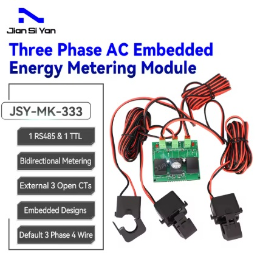
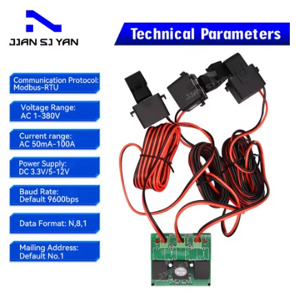
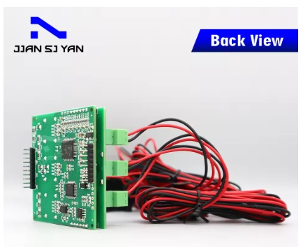
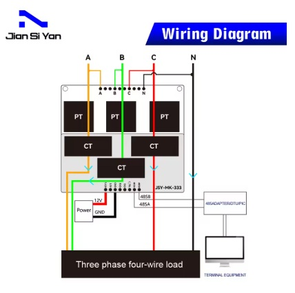

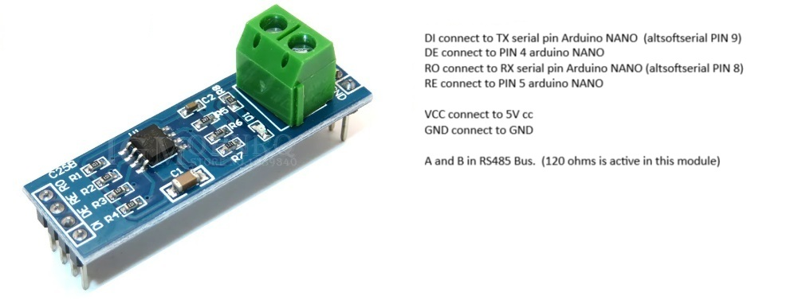

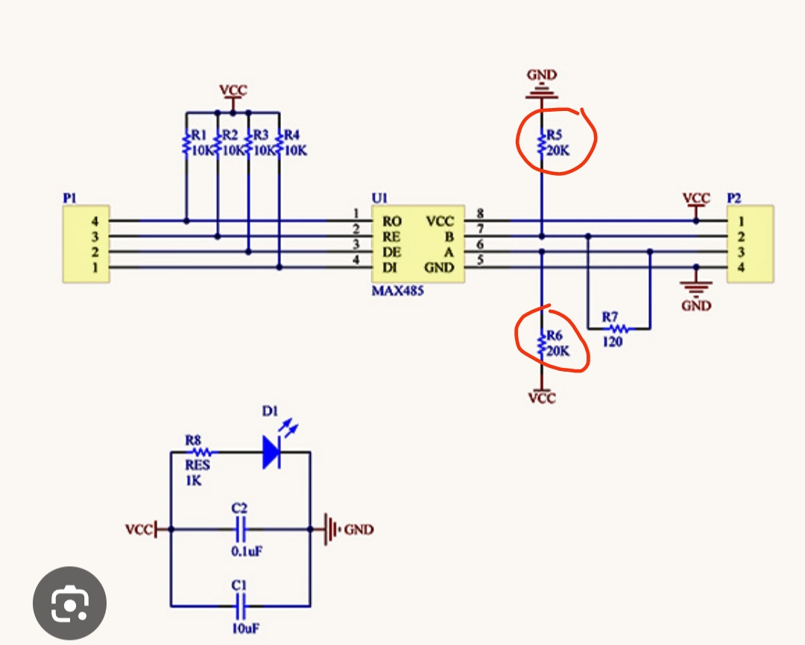

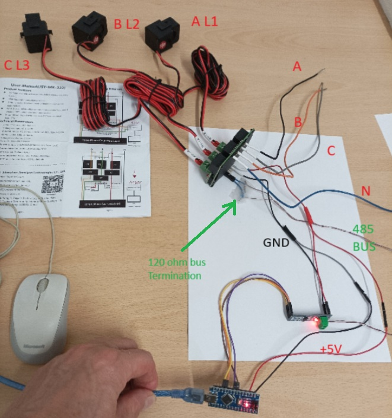

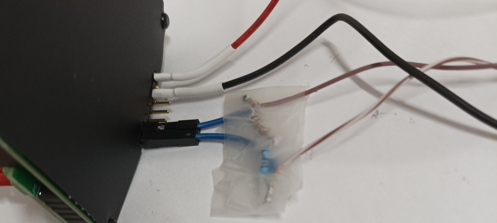

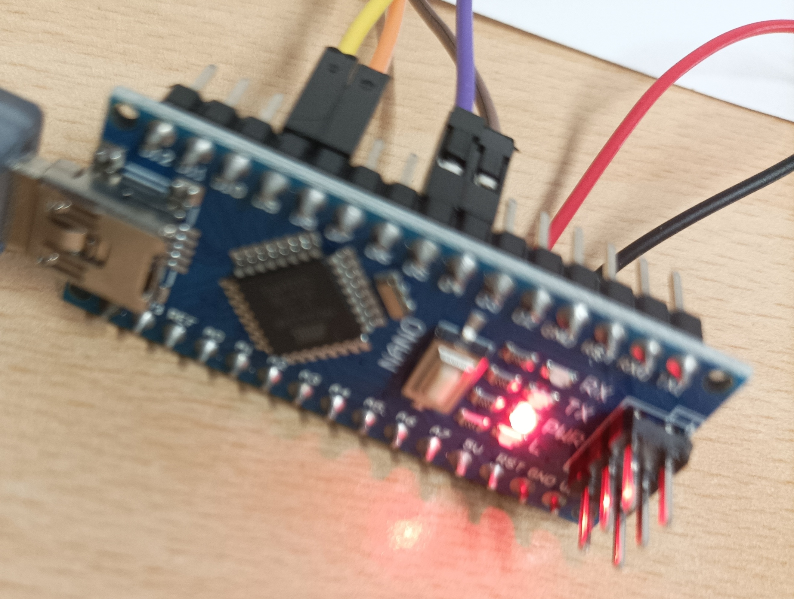

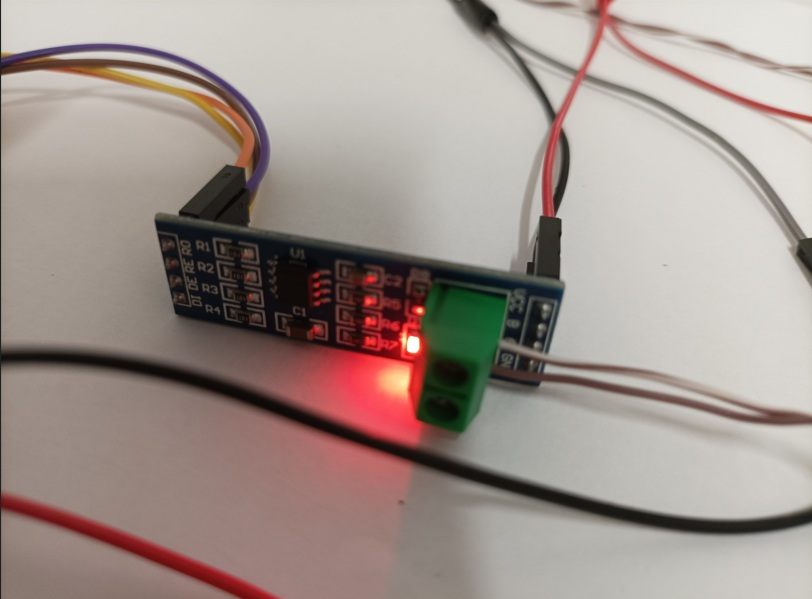

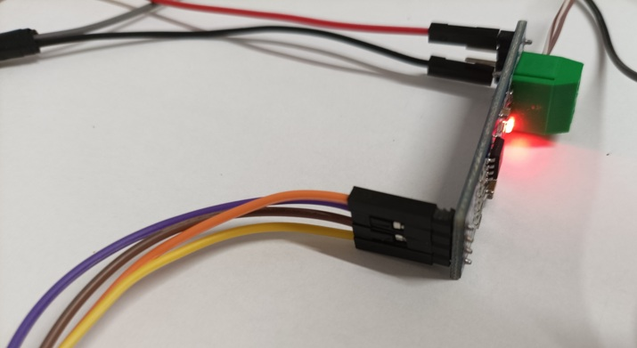

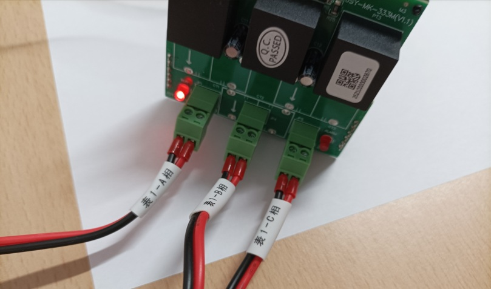

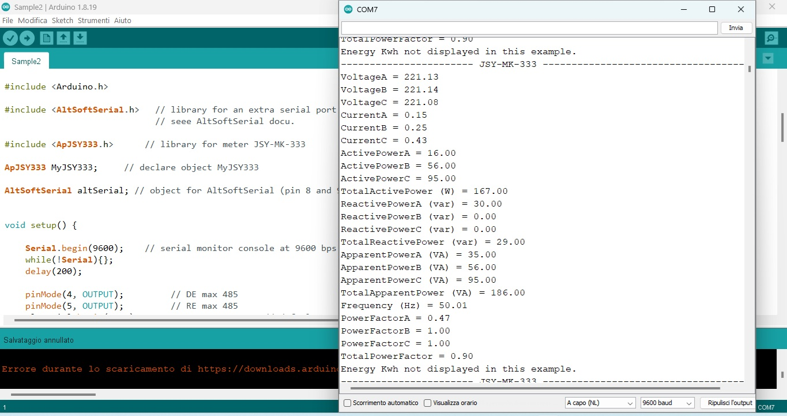

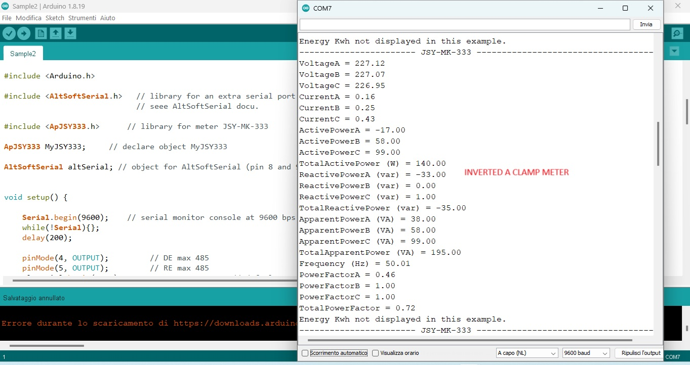

See doc folder for datascheet of meter.

detail of all the data provided by the meter

----- JSY-MK-333 --------------------------------
VoltageA = 221.77
VoltageB = 221.73
VoltageC = 221.67
CurrentA = 0.15
CurrentB = 0.25
CurrentC = 0.43
ActivePowerA = -16.00
ActivePowerB = 56.00
ActivePowerC = 95.00
TotalActivePower (W) = 135.00
ReactivePowerA (var) = -31.00
ReactivePowerB (var) = 0.00
ReactivePowerC (var) = 1.00
TotalReactivePower (var) = -32.00
ApparentPowerA (VA) = 35.00
ApparentPowerB (VA) = 56.00
ApparentPowerC (VA) = 95.00
TotalApparentPower (VA) = 187.00
Frequency (Hz) = 49.91
PowerFactorA = 0.47
PowerFactorB = 1.00
PowerFactorC = 1.00
TotalPowerFactor = 0.72
ActiveEnergyA (KWh) = 0.00
ActiveEnergyB (KWh) = 0.00
ActiveEnergyC (KWh) = 0.00
TotalActiveEnergy (KWh) = 0.00
ReactiveEnergyA (kvarh) = 0.00
ReactiveEnergyB (kvarh) = 0.00
ReactiveEnergyC (kvarh) = 0.00
TotalReactiveEnergy (kvarh) = 0.00
ApparentEnergyA (kVAh) = 0.00
ApparentEnergyB (kVAh) = 0.00
ApparentEnergyC (kVAh) = 0.00
TotalApparentEnergy (kVAh) = 0.00
ForwardActiveEnergyA (kWh) = 0.00
ForwardActiveEnergyB (kWh) = 0.00
ForwardActiveEnergyC (kWh) = 0.00
ForwardTotalActiveEnergy (kWh) = 0.00
OppositeActiveEnergyA (kWh) = 0.00
OppositeActiveEnergyB (kWh) = 0.00
OppositeActiveEnergyC (kWh) = 0.00
ForwardTotalActiveEnergy (kWh) = 0.00
ForwardReactiveEnergyA (kvarh) = 0.00
ForwardReactiveEnergyB (kvarh) = 0.00
ForwardReactiveEnergyC (kvarh) = 0.00
ForwardTotalReactiveEnergy (kvarh) = 0.00
OppositeReactiveEnergyA (kvarh) = 0.00
OppositeReactiveEnergyB (kvarh) = 0.00
OppositeReactiveEnergyC (kvarh) = 0.00
OppositeTotalReactiveEnergy (kvarh) = 0.00
---------------------------------------------------

